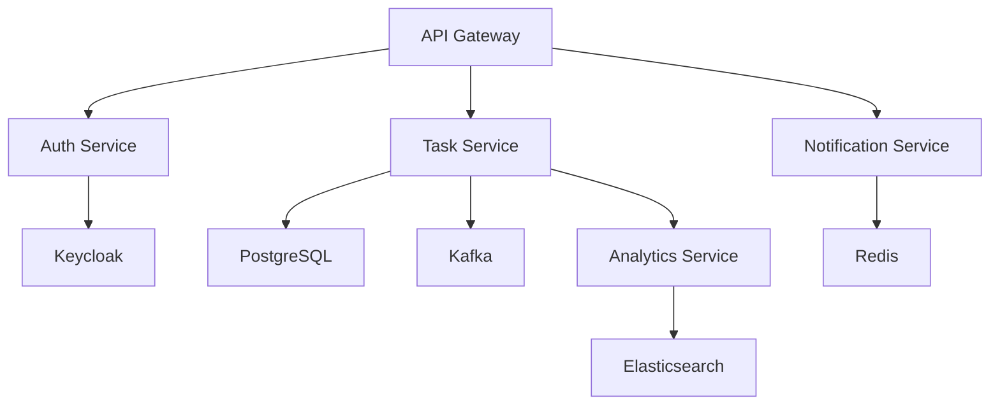

# Распределенный трекер задач
Распределенный трекер задач (аналог Jira)

Что делает:

Микросервисная архитектура (Spring Boot + Spring Cloud)

Управление задачами с тегами и дедлайнами

Уведомления в реальном времени через WebSocket

Аналитика продуктивности

Технологии:

Spring Boot 3 (Web, Data JPA, Security)

Apache Kafka для межсервисного взаимодействия

PostgreSQL + Redis для кэширования

Keycloak для OAuth2-аутентификации

Docker + Kubernetes

Prometheus + Grafana для мониторинга

Фишки:

Реализация Saga-паттерна для транзакций

Нагрузочное тестирование с Gatling

Генерация PDF-отчетов с Apache PDFBox

Интеграция с Google Calendar API
